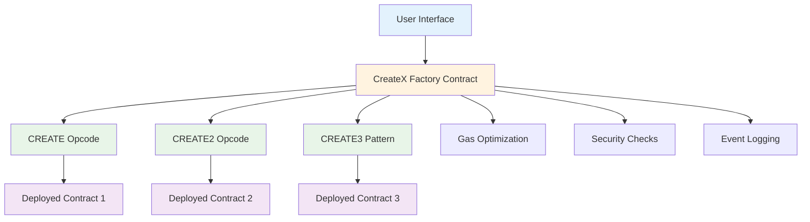

```mermaid
graph TB
    A[User Interface] --> B[CreateX Factory Contract]
    B --> C[CREATE Opcode]
    B --> D[CREATE2 Opcode]
    B --> E[CREATE3 Pattern]
    
    C --> F[Deployed Contract 1]
    D --> G[Deployed Contract 2]
    E --> H[Deployed Contract 3]
    
    B --> I[Gas Optimization]
    B --> J[Security Checks]
    B --> K[Event Logging]
    
    style A fill:#E3F2FD
    style B fill:#FFF3E0
    style C fill:#E8F5E8
    style D fill:#E8F5E8
    style E fill:#E8F5E8
    style F fill:#F3E5F5
    style G fill:#F3E5F5
    style H fill:#F3E5F5
```
